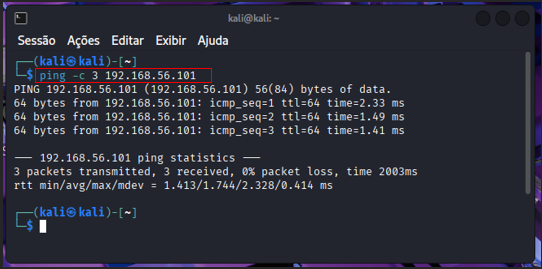
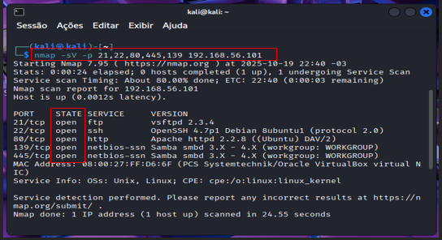
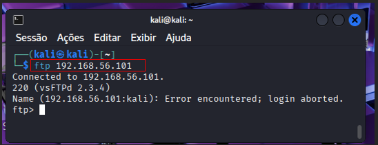
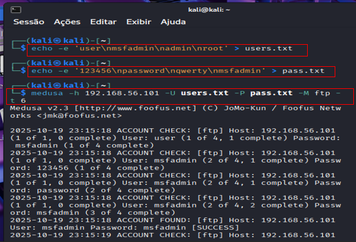

## 
Simulando um Ataque de Bruta Force de Senhas com Medusa e Kali Linux 

## 🛠 Ferramentas utilizadas
- Kali Linux
- METASPLOITABLE
- Medusa
- NMAP
- FTP

Desafio Final – Segurança Ofensiva com Kali Linux e Medusa Finalizei mais um desafio incrível na DIO, colocando em prática conceitos de pentest e auditoria de segurança!

 •	Configurei um ambiente com Kali Linux e Metasploitable 2 via VirtualBox.

•	Executei ataques simulados de força bruta em FTP, automação de login em DVWA, e password spraying em SMB.

•	Utilizei a ferramenta Medusa para testar autenticações e validar vulnerabilidades.

Esse projeto me ajudou a entender na prática como funcionam ataques de força bruta, como identificar falhas comuns e como propor soluções reais para ambientes vulneráveis.

Segurança da informação é uma área que exige ética, estudo e prática constante — e estou animada para seguir evoluindo!

#CyberSecurity #Pentest #KaliLinux #Medusa #DIO #SegurançaDaInformação #ForçaBruta #DVWA #GitHubPortfolio #AprendizadoContínuo

## 1.	Utilizando o comando  >  ping -c 3 192.168.56.101 <  com a finalidade de verificar se as duas VMs estão conectadas corretamente.

  

## 2.	Após conseguir se conectar, nosso objetivo será verificar se há vulnerabilidades no antigo FTP, utilizando a ferramenta > nmap <  

Obs: Foi verificado que, sim, há vulnerabilidades onde se encontra os “STATE open “ .

  

## 3.	Para verificar se o FTP está conectado utiliza-se o comando  “ftp e o IP da máquina “
Ex:  ftp 192.168.56.101
OBS: Porém, ainda não temos acesso de Login e Senha.

  

## 4.	Para conseguir o Login e Senha foi feita uma lista de possíveis login e senhas utilizadas e após o comando da ferramenta de ataque de força bruta   “ Medusa“.

Ex: 
     

 echo -e “user\nmsfadmin\nadmin\nroot’  >  users.txt

	echo -e ‘123456\npassword\nqwerty\nmsfadmin’  >  pass.txt

	medusa -h 192.168.56.101 -U users.txt -p pass.txt -M ftp -t 6 

Obs: Execução com SUCESS.
        

  

5.	Desta forma obtivemos sucesso ao acesso ao FTP com essas credencias.
Ex: ftp 192.168.56.101
      

  

##Desafio DIO